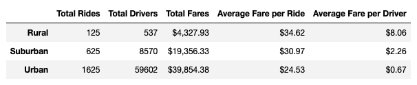
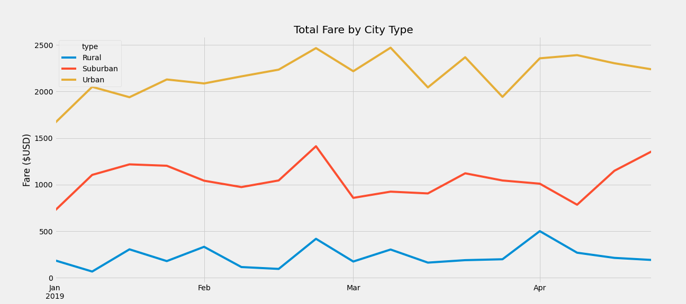

# **Overview of PyBer Analysis**

The purpose of this analysis project is to review the PyBer ride-sharing data to create a summary DataFrame of the ride-sharing data by city type. In addition to the DataFrame, another outcome of this analysis is also to visualize data analysis through a multi-line graph to show the total weekly fares for each city type. Lastly, the analysis will highlight any trends and observations from the ride-sharing based on city type and how decision-makers at PyBer can leverage the results of this analysis to inform business decisoins.

# **Results**
In the analysis, the PyBer ride-sharing data was evaluated based on city type and the specific data points of interest were: total rides, total drivers, total fares, average fare per ride, and average fare per driver.

###### *Summary DataFrame of PyBer Data*

Unsuprisingly, Urban city types had the highest total rides, total drives and total fares. This is expected due to population sizes and activity.

* **Total Rides:**
  * Rural: 125 rides
  * Suburban: 625 rides
  * Urban: 1625 rides
  
* **Total Drivers:**
  * Rural: 537 drivers
  * Suburban: 8,570 drivers
  * Urban: 59,602 drivers
  
* **Total Fares:**
  * Rural: $4,327.93 
  * Suburban: $19,356.33
  * Urban: $39,854.38

Where the analysis is more interesting is in the average fare per ride and average fare per driver based on city type. The average fare per ride is highest in rural cities and lowest in urban cities. This same pattern exists when we examine the average fare per driver, with rural drivers receiving significantly more per fare compared to urban drivers (at least 8 times more).

* **Average Fare per Ride:**
  * Rural: $34.62 average fare per ride
  * Suburban: $19,356.33 average fare per ride
  * Urban: $39,854.38 average fare per ride
  
* **Average Fare per Driver:**
  * Rural: $8.06 average fare per driver
  * Suburban: $2.26 average fare per driver
  * Urban: $0.67 average fare per driver

When assessing the total fare by city type and comparing the weekly fares earned from January through April 2019, the general trend is a peak in total fares for all city types in the weeks leading up to March. Each city type's total fare drops and increases on different schedules and it would be important to conduct more research to understand if there could be other activities occuring in each city type during certain periods of the year that would be good opportunities to capitalize on in terms of demand for rides.

###### *Multi-line graph of ride-sharing data by city type*

 # **Summary**
Based on the analysis conducted of our PyBer ride-sharing data for each city type, it appears each city type has different demand, rider types and rider needs. Any strategies to address the disparities observed between the city types from this analysis will require further research to understand those three factors in order to craft and tailor any campaigns targeted to city types. Based on this brief analysis, below are three recommendations to the CEO to address what was discovered in the analysis, particularly the disparities noted between the city types. 

1. **Introduce a membership subscription for rural riders.** Rides in rural cities are low however the average fare per ride and average fare is very high. Rural riders are most likely riding for longer distances. A membership subscription could encourage more rides if there was an added benefit to the rider for being a member, such as a limited number of free rides per month or a small discount offered to the rider for each ride up to a certain amount of rides.

2. **Partner with local event vendors.** Partnering with local event vendors can increase rideship during periods where there is high demand for rides. By understanding community events and activities, we can better anticipate opportunities where we can generate more demand. Offering packages with event vendors for promotions on rides to the event can encourage rideship for both Suburban and Urban city types. Events will happen more likely in an urban setting however there may be attendees from suburban settings who would liek to get to the event. This will generate rideship for both Suburban city types and Urban city types. If suburban riders are utilizing ride-sharing to attend events in urban settings that will also increase the average fare per ride.

3. **Offer incentives to drivers to expand their location.** The urban cities have the highest number of drivers compared to the other city types. As a result, while Urban city types had the highest number of total rides, they also had the lowest average fare per driver. If urban drivers were incentivized and provided bonuses for being willing to drive and transport riders in other city types, this could help with providing more drivers to other city types and increase the average fare earned per driver. Additional research would be needed to confirm demand for ridership in other city types prior to investment in this strategy. 
